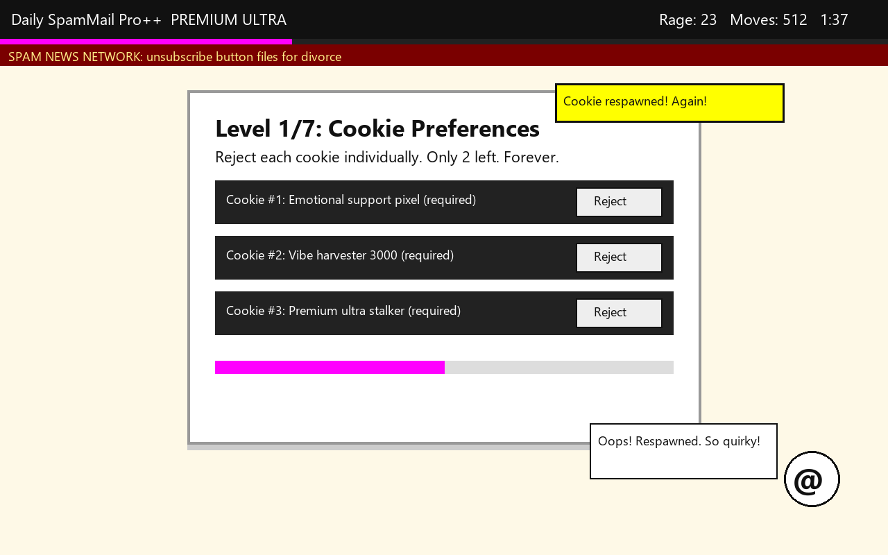
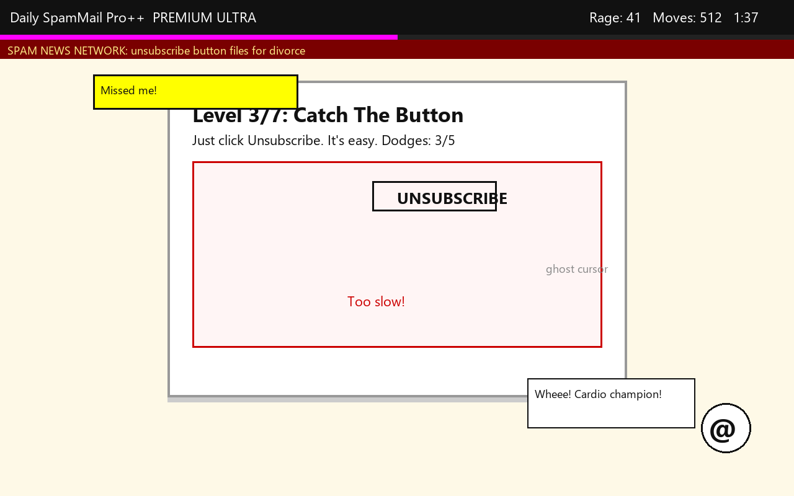
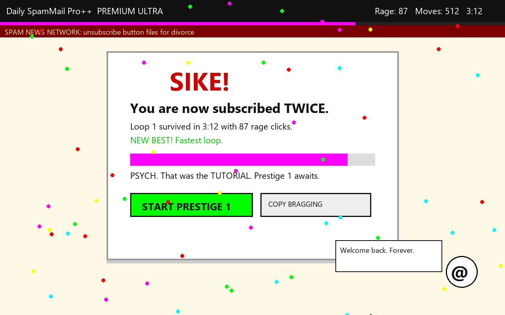
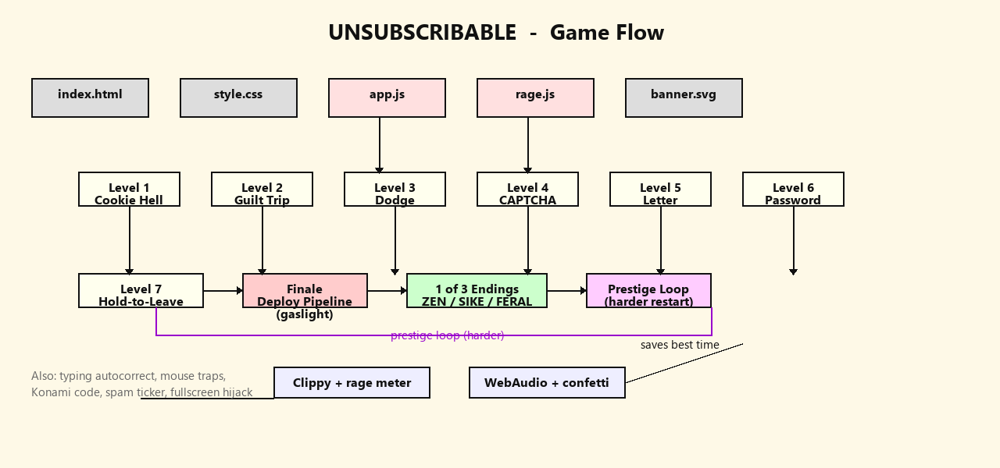

# 📧 UNSUBSCRIBABLE 🎯
> You can check out anytime you like… but you can never leave.

## Basic Details
### Team Name: [Your Team Name]
### Team Members
- Team Lead: [Your Name] - [College]
- (Solo build — add teammates here if any join)

### Project Description
A newsletter you can never leave. UNSUBSCRIBABLE is a rage-bait browser game: 7 scammy levels (respawning cookies, guilt-tripping modals, a fleeing button, a lying CAPTCHA, a letter-eating form, an absurd password, a hold-while-attacked button) ending in a fake deploy pipeline that gaslights you at 85% — then 3 different endings based on your rage.

### The Problem (that doesn't exist)
Unsubscribing from newsletters is far too easy. One click? Where's the commitment? Where's the drama?

### The Solution (that nobody asked for)
A 7-stage unsubscribe flow with 47 fake microservices, pity systems that guarantee suffering (but never freedom), a rage meter with ranks from CALM 🧘 to CLIPPY HATER 👹, and a finale that subscribes you TWICE.

## Technical Details
### Technologies/Components Used
For Software:
- HTML + CSS + vanilla JS (zero dependencies, zero backend)
- WebAudio API (beeps, win fanfare — no audio files)
- Canvas API (confetti particles)
- localStorage (best score, victims counter — works offline on `file://`)

### Implementation
For Software:
# Installation
```powershell
# nothing to install — 100% static
git clone [your-fork-url]
cd unsubscribe-hell
```
# Run
```powershell
# just open it
start index.html
# or serve it (needed for clipboard API)
npx serve .
```
# Deploy (for submission — a live link is required)
1. Push this folder to your forked repo (or drag it into Netlify Drop)
2. GitHub Pages: repo Settings → Pages → Deploy from branch → pick branch + `/unsubscribe-hell` folder
3. Paste the live URL at the top of this README + in the hub app submission

**Live Demo:** [ADD YOUR DEPLOYED LINK HERE]

### Project Documentation
For Software:
# Screenshots (Add at least 3)
 *Cookie Hell — reject 5 cookies that respawn*
 *The unsubscribe button fleeing the cursor*
 *SIKE — subscribed twice + rage stats*
> Capture these during the event (Win+Shift+S) and drop them in a `screenshots/` folder.

# Diagrams
 *Start → 7 levels (each with pity exit) → fake deploy (gaslight at 85%) → 1 of 3 rage endings. Clippy + rage meter observe everything.*
> Sketch the flow on paper, photo it, save as `diagrams/flow.png`. Judges love a hand-drawn diagram.

### Project Demo
# Video
[ADD YOUR DEMO VIDEO LINK HERE] *60s: tiny link → rage to FERAL → whiff the dodge → finale crash → SIKE ending reveal.*
# Additional Demos
- Playable offline straight from `index.html` (dead stage wifi approved)
- `JOURNAL.md` has the build log (project-journal side quest)

## Team Contributions
- [Your Name]: game design, all 7 levels, rage systems, README + demo
- Built solo with an AI pair-programmer (planning + boilerplate), all cruelty decisions by a human

## Why it scores (judging: 60% creativity / 20% complexity / 20% cross-disciplinary)
- **Creativity:** unsubscribing-as-boss-rush + 3 rage-based endings + 47 fake microservices deploying on a Friday
- **Complexity:** pity systems, shuffled content per run, canvas confetti, shared AudioContext, touch+mouse, offline persistence
- **Cross-disciplinary:** game design + sound design (WebAudio jingles) + comedy writing + UX dark-pattern satire
- **Side quests targeted:** best game / interactive media, most over-engineered solution to a non-problem

---
Made with ❤️ at TinkerHub Useless Projects
