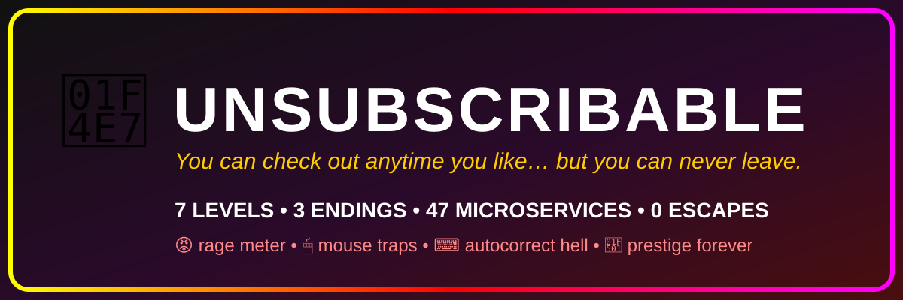

[](https://savio-shejo.github.io/unsubscribable/)
[](index.html)
[](index.html)
[](https://tinkerhub.org)

> You can check out anytime you like… but you can never leave.

**[▶ Click here to suffer](https://savio-shejo.github.io/unsubscribable/)** — no install, no signup, no mercy.

| 🍪 Cookie Hell | 🥺 Guilt Trip | 🏃 Fleeing Button | 🤖 Lying CAPTCHA | 💔 Letter Eater | 🔑 Absurd Password | 🫳 Hold Attack |
|---|---|---|---|---|---|---|
| rejects respawn | STAY grows | proximity flee + ghost cursor | always wrong twice | `hate` → `love` | emoji + Roman numeral + no "e" | Clippy attacks at 600ms |

Beat it all? **PSYCH — that was the tutorial.** Prestige loop restarts harder, forever. 3 endings by rage: 🧘 ZEN / 🎉 SIKE / 🦍 FERAL (hired as Chief Rage Officer).

## Basic Details
### Team Name: Solving Nothing
### Team Members
- Team Lead: Savio Shejo - Sahrdaya College of Engineering & Technology
- (Solo build)

### Project Description
A newsletter you can never leave. UNSUBSCRIBABLE is a rage-bait browser game: 7 scammy levels (respawning cookies, guilt-tripping modals, a fleeing button, a lying CAPTCHA, a letter-eating form, an absurd password, a hold-while-attacked button) ending in a fake deploy pipeline that gaslights you at 85% — then reveals it was the tutorial and restarts harder. There is no winning. Best loop time is tracked for speedrunners of suffering.

### The Problem (that doesn't exist)
Unsubscribing from newsletters is far too easy. One click? Where's the commitment? Where's the drama?

### The Solution (that nobody asked for)
A 7-stage unsubscribe flow with 47 fake microservices, pity systems that guarantee suffering (but never freedom), a rage meter with ranks from CALM 🧘 to CLIPPY HATER 👹, a finale that subscribes you TWICE — then prestige-loops forever.

## Technical Details
### Technologies/Components Used
For Software:
- HTML + CSS + vanilla JS (zero dependencies, zero backend)
- WebAudio API (beeps, win fanfare — no audio files)
- Canvas API (confetti particles)
- Fullscreen API (first tap goes fullscreen — poetic)
- localStorage (best loop, victims counter — works offline on `file://`)

### Implementation
For Software:
# Installation
```powershell
# nothing to install — 100% static
git clone https://github.com/Savio-Shejo/unsubscribable.git
cd unsubscribable
```
# Run
```powershell
# just open it
start index.html
# or serve it (needed for clipboard API)
npx serve .
```
# Deploy (for submission — a live link is required)
Already live: **https://savio-shejo.github.io/unsubscribable/** (GitHub Pages, `main` branch, `/(root)`).
To redeploy after changes: `git add -A; git commit -m "rage"; git push` — Pages rebuilds in ~2 min.

**Live Demo:** https://savio-shejo.github.io/unsubscribable/

### Project Documentation
For Software:
# Screenshots (Add at least 3)
 *Cookie Hell — reject 5 cookies that respawn*
 *The unsubscribe button fleeing the cursor + ghost trail*
 *SIKE — subscribed twice + prestige offer*
> Capture these during the event (Win+Shift+S) and drop them in a `screenshots/` folder.

# Diagrams
 *Start → 7 levels (each with pity exit) → fake deploy (gaslight at 85%) → 1 of 3 rage endings → prestige loop. Clippy + rage meter observe everything.*
> Sketch the flow on paper, photo it, save as `diagrams/flow.png`. Judges love a hand-drawn diagram.

### Project Demo
# Video
[ADD YOUR DEMO VIDEO LINK HERE] *60s: tiny link → rage to FERAL → whiff the dodge → finale crash → SIKE ending reveal.*
# Additional Demos
- Playable offline straight from `index.html` (dead stage wifi approved)
- `JOURNAL.md` has the build log (project-journal side quest)

## Team Contributions
- Savio Shejo: game design, all 7 levels, rage systems, README + demo
- Built solo with an AI pair-programmer (planning + boilerplate), all cruelty decisions by a human

## Why it scores (judging: 60% creativity / 20% complexity / 20% cross-disciplinary)
- **Creativity:** unsubscribing-as-boss-rush + 3 rage-based endings + prestige treadmill + 47 fake microservices deploying on a Friday
- **Complexity:** pity systems, shuffled content per run, canvas confetti, shared AudioContext, touch+mouse, offline persistence
- **Cross-disciplinary:** game design + sound design (WebAudio jingles) + comedy writing + UX dark-pattern satire
- **Side quests targeted:** best game / interactive media, most over-engineered solution to a non-problem

---
Made with ❤️ at TinkerHub Useless Projects
